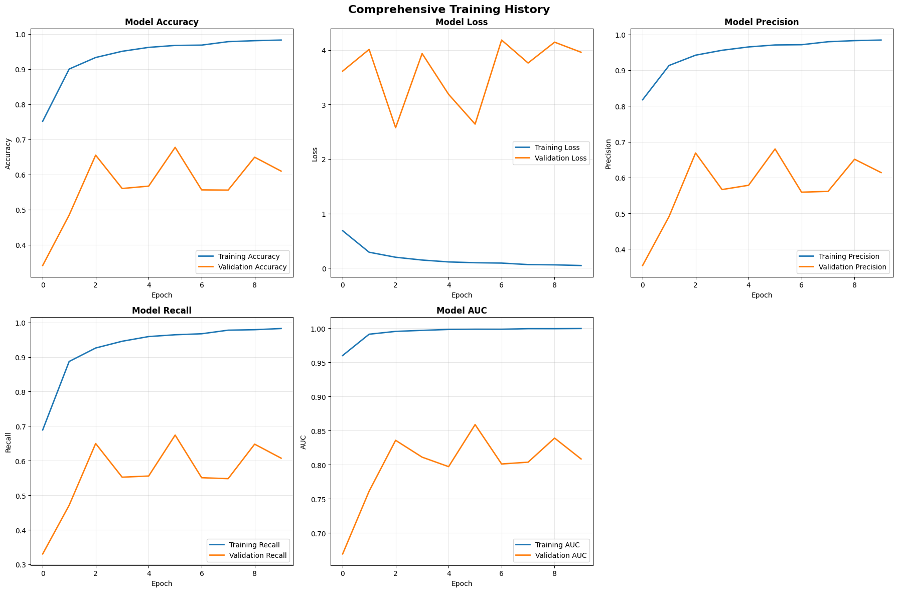
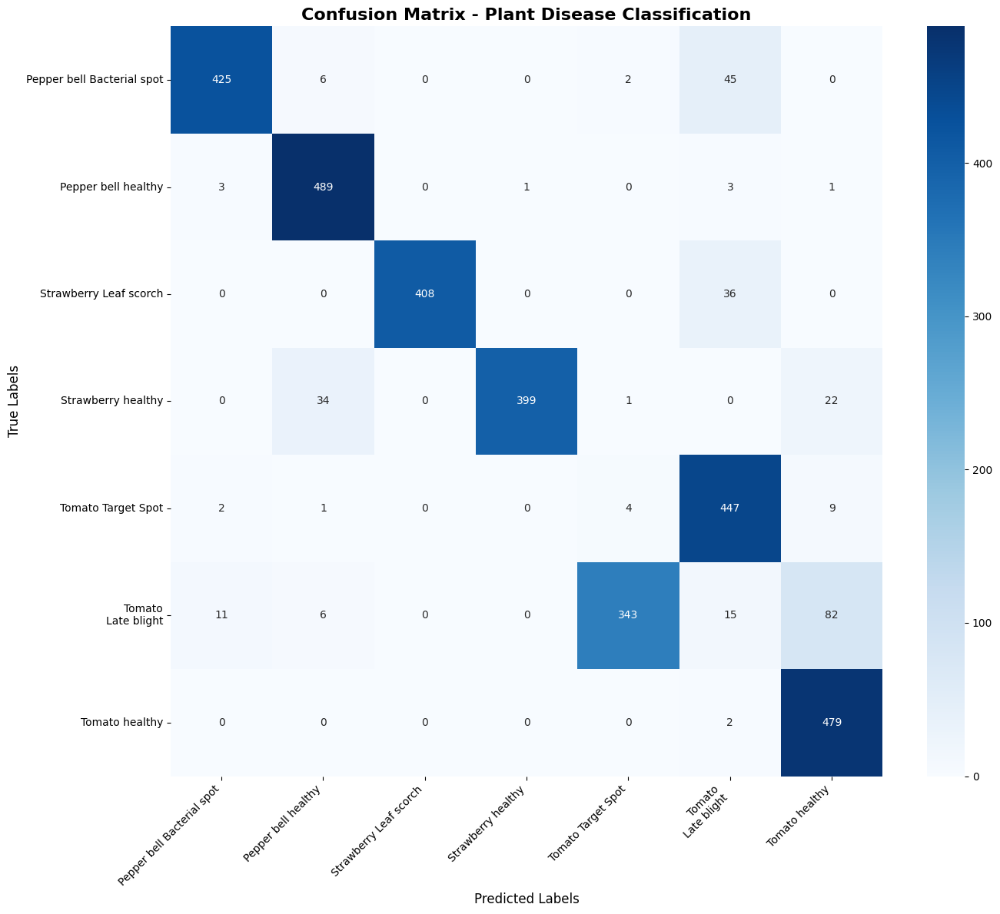
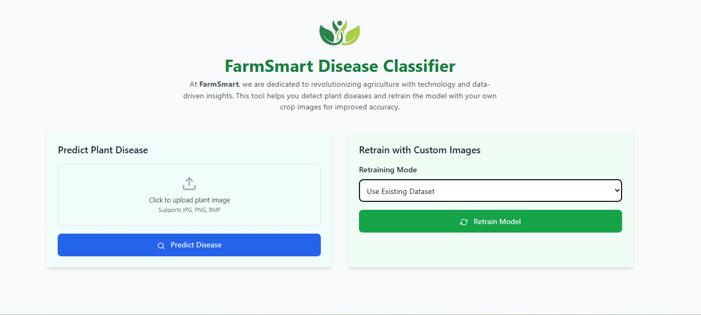
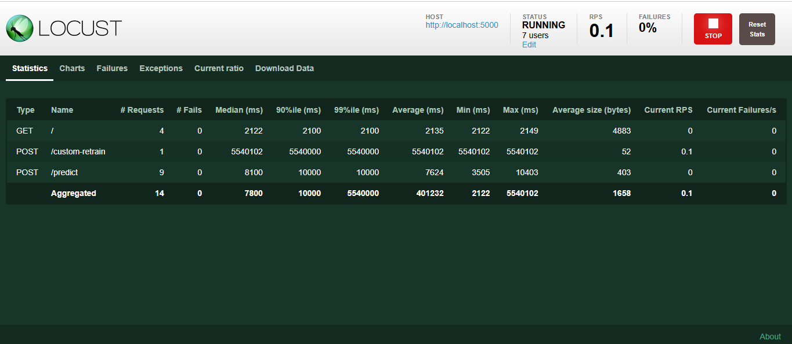

# FarmSmart Disease Classifier

**African Leadership University**  
**Afsa Umutoniwase**

---

## Project Overview

FarmSmart Disease Classifier is an end-to-end machine learning pipeline designed to detect plant diseases from images. Built using TensorFlow and Flask, the solution supports:

- Image classification (plant disease prediction)
- Model evaluation with advanced metrics
- Custom retraining triggered via UI or API
- Real-time API deployment with Locust load testing
- Clear visualization of training and evaluation metrics

This pipeline demonstrates the **complete ML lifecycle** from data ingestion to deployment on a simulated production server.

---

## Objective

To build, evaluate, and deploy a machine learning classifier on **image data**, incorporating:

- A prediction API
- A retraining trigger
- Evaluation metrics (accuracy, loss, precision, recall, AUC, F1)
- UI + Deployment setup
- Load testing via Locust
- Upload/retrain functionality

---

## Project Structure

```
FarmSmart/
│
├── README.md
├── notebook/
│   └── farmsmart_notebook.ipynb         ← Full ML pipeline notebook
│
├── src/
│   ├── app.py                           ← Flask app (API endpoints)
│   ├── model.py                         ← Model training + evaluation
│   ├── preprocessing.py                 ← Data loading utilities
│   ├── prediction.py                    ← Image prediction logic
│   └── locustfile.py                    ← Load testing script
│   └── static/
│       └── logo.png                     ← Web UI assets
│
│   └──templates/
│      └── index.html                    ← HTML UI
│
├── dataset/
│   ├── train/                           ← Training images
│   ├── valid/                           ← Validation images
│   ├── test/                            ← Single image test set
│   └── retrain/                         ← Folder for retrain uploads
│       ├── train/
│       └── valid/
│
├── models/
│   └── farmsmart.keras                  ← Saved model file
│
│
├── farmsmart.db                         ← SQLite DB for predictions & retrain logs
```
---

## Setup Instructions

### Requirements

- Python 3.8+
- TensorFlow
- Flask
- Locust
- matplotlib, seaborn, scikit-learn, etc.

Install dependencies:

```bash
pip install -r requirements.txt
```

---

## Running the App

### 1. Train Model (Offline)

```bash
python src/model.py
```

This script builds, trains, evaluates, and saves the model (`models/farmsmart.keras`).
If you prefer a visual, step-by-step explanation of the training pipeline, see the accompanying notebook at notebook/farmsmart_notebook.ipynb


## Model Performance Overview
The model achieved over 99% accuracy, precision, recall, and AUC on the training set, indicating strong learning capacity. However, validation metrics remained unstable, with accuracy and recall fluctuating between 55–66% and loss remaining high—suggesting overfitting and limited generalization.

Confusion matrix analysis revealed frequent misclassifications between visually similar classes like Tomato Late Blight and Tomato Healthy. These issues point to the need for improved regularization, better class balance, and targeted data augmentation in future iterations.


### 2. Start Flask API

```bash
cd src
python app.py
```

- Navigate to `http://localhost:5000`
- Predict via `/predict`
- Retrain via `/custom-retrain`

### 3. Load Test with Locust

```bash
locust -f src/locustfile.py --host=http://localhost:5000
```

Go to `http://localhost:8089` to simulate user traffic and view response stats.

---

# Using the Web UI

Access the dashboard in your browser:  
http://localhost:5000

## Predict Plant Disease

- Click **"Predict Plant Disease"**  
- Upload a plant image (JPG, PNG, or BMP)  
- Click **"Predict Disease"**  
- View the predicted class and confidence score below the form

## Retrain with Custom Images

- Click **"Retrain with Custom Images"**  
- Choose a **Retraining Mode**:
  - **Use Existing Dataset** *(no uploads required)*  
  - **Upload New Disease Class**, then:
    - Enter a class name (e.g., `Tomato_Blight`)  
    - Upload at least:
      - 10 training images  
      - 5 validation images  
- Click **"Retrain Model"**  
- A retraining status message will appear showing progress




## Features

### Prediction

Upload a single image via UI or API `/predict`. Returns:
- Top prediction
- Confidence score
- All class probabilities

### Retraining

Upload new class data via `/custom-retrain` (min 5 train + 5 valid images). Retrains the model and saves new weights.

### Evaluation Metrics

Evaluates using:
- Accuracy, Loss, Precision, Recall
- AUC-ROC, F1 Score
- Cohen's Kappa & MCC
- Confusion matrix
- Per-class metrics

### Visualizations

- Training history (acc/loss/precision/recall)
- Confusion matrix
- Per-class bar plots

---

# Video Demo

 [YouTube Demo Link](https://your-demo-link.com)  
_(Includes both prediction and retraining demonstration)_

---

# Load Testing with Locust
To simulate multiple users interacting with the system and monitor performance under load, Locust was used.
Running Locust
```bash
locust -f src/locustfile.py --host=http://localhost:5000
```
Visit the Locust dashboard at `http://localhost:8089` and specify the number of users and spawn rate to simulate traffic.
Simulated User Behavior
• `/` - GET - Web UI homepage access
• `/predict` - POST - Predict disease from image
• `/custom-retrain` - POST - Trigger model retraining
Locust Test Results Summary


- Users simulated: 7
- Total requests sent: 14
- Failures: 0%
- Average response time:
  - `/predict`: ~7624ms
  - `/custom-retrain`: ~5540s (long due to retraining)
  - `/`: ~2135ms
- Longest response: 5540102ms (custom retrain)
- All endpoints responded successfully without failure

This demonstrates that:
- The prediction and UI routes scale decently under light concurrent usage.
- Retraining is resource-heavy and should be throttled or queued in production settings.

---

## Summary

This project showcases a fully functional ML system:
- End-to-end classification pipeline
- Real-time deployment with prediction & retraining
- Monitoring & testing via Locust
- Clear visual reports and evaluation metrics

